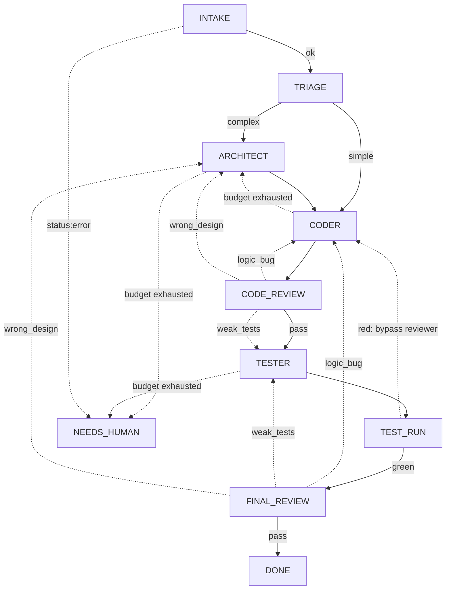

# orchestrator/ — детерминированный control plane PDD

Ядро Loop Engineering-рантайма: код, который сам прогоняет задачу по графу стадий.
**Маршрут принимает код, не LLM.** Модель исполняет роль внутри стадии (классифицирует,
правит файлы), а `router` решает, куда идти дальше, сколько бюджета осталось и когда
остановиться.

## Purpose

Превратить `task.md` + `task_meta.json` в результат (диффы / ветка / PR + отчёт) или в
явный `NEEDS_HUMAN` с handoff. Всё состояние — только в файлах-артефактах под `runs/<job>/`;
ничего не держится в памяти между стадиями. Опасные стадии исполняются в Docker-песочнице
(см. `../sandbox/`), и пайплайн **fail-closed**: без изоляции исполняющая стадия не стартует.

## Поток (граф стадий)

Сплошные стрелки — happy-path вперёд; пунктир — loop-back/эскалация/ошибка. Любая стадия с
`status:"error"` уходит в `NEEDS_HUMAN`. Сверх графа есть два глобальных тормоза в `router`:
`global_step_cap` (потолок шагов) и **no-progress detector** (повтор signature на complaint
loop-back) — оба ведут в `NEEDS_HUMAN`. Терминалы: `DONE`, `NEEDS_HUMAN`.

## Contents

**Топология и маршрутизация**

| Модуль | Ответственность |
|---|---|
| `graph.py` | Узлы, таблица `ORDER`, классификации, `CLASS_TO_STAGE`. Только данные. |
| `router.py` | `decide_next(node, result, state)` — **чистая** функция: маршруты, бюджеты, no-progress, лестница эскалации. |
| `triage.py` | Нужен ли первичный `ARCHITECT` (пороги по `task_meta`, без LLM). |
| `driver.py` | Главный цикл `run_job`: run → route → persist, пока не терминал. |

**Исполнение стадий**

| Модуль | Ответственность |
|---|---|
| `stages.py` | Реальный `run_node`: structured (reviewer, `--json-schema`), free-form (architect), editor (coder/tester правят worktree). |
| `runner.py` | Спавн qwen: argv, ключ **только через env**, stdin-промпт, двойной таймаут, `classify_limit` (exit 55), маршрут в песочницу. |
| `verdict.py` | Парс/валидация `structured_output` + `salvage_verdict` (JSON из текста), `verdict_signature`. |
| `artifacts.py` | Чтение/запись артефактов + сборка промпта стадии. |

**Граница безопасности** (контракт — в `../sandbox/`)

| Модуль | Ответственность |
|---|---|
| `sandbox.py` | Docker-граница: `ensure_ready` (fail-closed), `run_in_sandbox`, egress-allowlist, audit. |
| `testrun.py` | `TEST_RUN` в контейнере с `--network none`. |
| `worktree.py` | git worktree на джоб (ветка `pdd/<job>`), дифф, force-rmtree осиротевшего. |
| `killtree.py` | Kill всего дерева процессов (win/posix). |

**Состояние, очередь, наблюдаемость**

| Модуль | Ответственность |
|---|---|
| `state.py` | `state.json` + `transitions/attempts.jsonl`, `validate_job_id`. |
| `events.py` | Единый структурный `events.jsonl` — timeline джоба. |
| `progress.py` | Live-строка прогресса для run/resume/retry. |
| `queue.py` | Durable файловая очередь джоб под `runs/queue/` *(PDD-25; мёржится своим PR)*. |
| `reaper.py` | TTL-reaper зависших джоб/worktree. |
| `config.py` | Бюджеты, таймауты, model-креды, пути. Plain data. |

**Продуктовый I/O и точки входа**

| Модуль | Ответственность |
|---|---|
| `jira.py` | Нормализация Jira issue JSON → `task.md`/`meta`; драфт коммента. |
| `publish.py` | Коммит worktree в ветку (+ опц. push / PR через `gh`). |
| `report.py` | Человекочитаемый Markdown-отчёт по джобу (ASCII). |
| `doctor.py` | Self-check окружения (Python/git/qwen/docker/sandbox). |
| `run.py` | `run_pipeline` / `resume_pipeline` / `retry_pipeline`. |
| `menu.py` | Интерактивное arrow-key меню (`pdd` без аргументов). |
| `cli.py` | Единая точка входа (argparse). |

Подкаталоги: `prompts/` — промпты ролей (контракт стадии), `schemas/` — JSON-схемы
structured-вердиктов.

## Key concepts

1. **LLM только классифицирует — стадию называет код.** Вердикт ревьюера несёт `class`
   (`logic_bug`/`weak_tests`/`wrong_design`/`nit`); `graph.CLASS_TO_STAGE` и
   `CLASS_PRIORITY` переводят класс в целевую стадию. Модель никогда не выбирает узел.
2. **`router.decide_next` — чистая функция.** Делает `deepcopy(state)`, возвращает новое
   состояние, **не мутирует вход**. Это единственное место маршрутов/бюджетов/эскалации.
3. **Состояние живёт только в файлах.** Между стадиями ничего не передаётся в памяти —
   всё через `runs/<job>/` (`state.json`, `*.jsonl`, артефакты). Отсюда resume/retry.
4. **Бюджеты на return-targets.** Только `ARCHITECT/CODER/TESTER` несут бюджет попыток;
   он списывается на входе в стадию. Лестница: `CODER` исчерпан → replan `ARCHITECT` →
   `NEEDS_HUMAN`.

## Invariants & gotchas

- **Граница безопасности = Docker-песочница, а НЕ worktree и НЕ review.** worktree
  изолирует файлы, review — гейт качества. Исполняющие стадии (`CODER`/`TESTER`) и
  `TEST_RUN` идут под `--yolo`. Не ослабляй sandbox-дефолты (`--cap-drop ALL`,
  `--read-only`, non-root, no-new-privileges, internal-сеть) без отдельной sandbox-задачи.
- **`TEST_RUN` всегда `--network none`.** Этот инвариант не трогать.
- **Секреты — только через env.** Никогда в argv / артефакты / логи / отчёты / тесты.
- **No-progress кормят только complaint-loop-backs.** Forward-прогресс, входящий в
  return-target, бюджет не списывает и в детектор stall не идёт (см. флаг `complaint`).
- **fail-closed:** нет Docker и нет явного `PDD_ALLOW_UNSANDBOXED=1`/`PDD_REQUIRE_SANDBOX=0`
  → `SandboxUnavailable`, стадия не стартует.
- **Грабли мёржа `cli.py`:** конфликт в `build_parser` однажды съел сабкоманды. При мёрже
  двух веток, трогающих CLI, — проверить, что все сабкоманды на месте.

## How to extend

- **Новый узел графа:** объяви константу/`ORDER`/классификацию в `graph.py` → добавь переход
  в `router._intended_next` → реализуй в `stages.run_node` → тесты в `tests/test_router.py`.
- **Новый класс вердикта:** `graph.CLASS_TO_STAGE` + `CLASS_PRIORITY` (+ схема в `schemas/`).
- **Смена контракта роли:** правь `prompts/<role>.md` — поведение стадии описано там, не в коде.
- Любая новая логика маршрута/persist/CLI/report **обязана** нести фокусные тесты, и её ядро
  должно тестироваться без реальных model/network/Docker.

## Related

- [Корневой README](../README.md) · [docs/STATUS.md](../docs/STATUS.md) (snapshot, см. git за актуальным)
- [sandbox/README.md](../sandbox/README.md) — контракт границы безопасности
- [prompts/](prompts/) — контракты ролей · [Loop Engineering backlog](../docs/LOOP_ENGINEERING_PROJECT.md)
